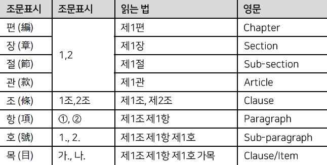
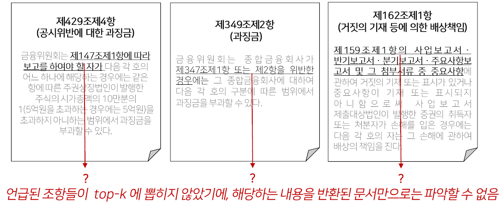
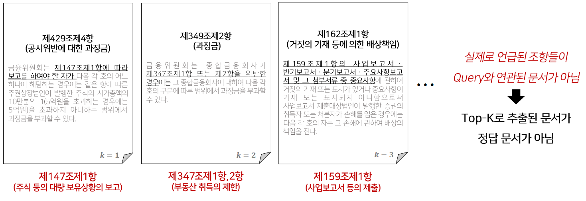
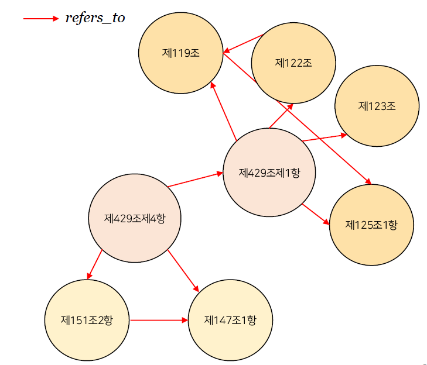
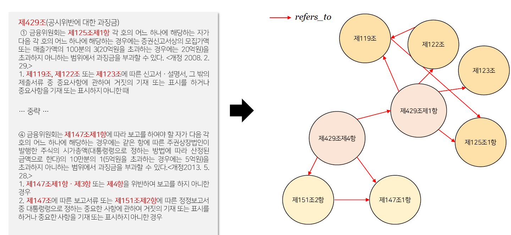
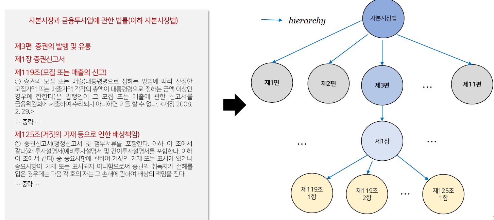

# legal_graph
**GraphRAG 기반의 온톨로지 지식 법률 QA 챗봇 시스템 구축**

> Ontology-based Legal Knowledge QA Chatbot with GraphRAG System


## Abstract
- 대규모 언어 모델(LLM)은 일상 언어/일반적인 지식 생성은 뛰어나지만, 도메인 특화 분야 답변 생성에는 어려움이 있음
    - 정확성 : 법률, 금융과 같은 Domain Specific Task는 조항과 규정에 따른 구체적이고 정확한 답변이 필수
    - 최신성 : 지속적인 업데이트가 불가능하여 최신 정보 기반으로 즉각 대응이 어려움 
    
- 관련 높은 문서 검색을 통해 전문 지식을 보강하여 답변의 신뢰도를 높이자!
-> **RAG(Retrieval-Augmented Generation)**


### Why GraphRAG?
- 기존에는 Query와의 Vector cosine similarity를 기반으로 유사도가 높은 문서를 반환 (=VectorRAG, NaiveRAG)
- 하지만 법률 데이터의 특성을 온전히 담아내지 못하는 한계가 존재

- 법률 데이터의 특징
    1. 법률 조문 체계 존재 (편 > 장 > 절 > 관 > 조 > 항)
        
        - 법률 조항 간 명확한 참조 / 구조적 관계를 나타내어야 함
        - 단순 Chunking하여 문서를 분리하게 되면, 법률 내의 계층 구조를 잃어버림
    2. 텍스트 내 명시적 연결 관계
        - 법률 데이터는 본문 안에 다른 조항을 직접적으로 언급하여 명시적 연결 관계를 가짐
        - Vector Database에서는 이러한 객체 간의 연결 관계를 표현하기 어려움


### Example
> "증권신고서를 부실기재했을 때 법인의 대표자에게 부과되는 과징금은 얼마인가?”

- VectorRAG



- GraphRAG


-> 조항 간의 연결 관계 명시적으로 드러냄


**따라서 '법률' 도메인에 맞는 데이터 표현 방식은, Vector보다 Graph를 사용하는 것이 적합하다.**


## Data
### 수집된 원천 데이터 목록
    ```bash
    ├─**01_자본시장과금융투자업에관한법률** // GraphDB 구축 완료
    ├─02_금융지주회사감독규정
    ├─03_증권의발행및공시등에관한규정
    ├─04_kofia
    ├─05_전자단기사채등의발행및유통에관한법률
    ├─06_기업공시서식작성기준
    ├─07_기업공시실무안내
    ├─08_은행법
    ├─09_DART
    ├─10_개인정보보호법
    ├─11_전자금융거래법
    └─12_전자서명법
    ```

### Node property
    ```json
    번호(law_index): 제125조제1항
    조항 제목(name) : 거짓의 기재 등으로 인한 배상책임
    법률 제목(document_title) : 자본시장과 금융투자업에 관한 법률
    편(Chapter) : 제3편 증권의 발행 및 유통
    장(Section) : 제1장 증권신고서
    절(Sub-Section) : None
    관(Article) : None 
    시행일(created_data): 2024.7.1
    개정일(revise_info): 2008.2.29
    데이터 수집 출처(source) :  국가법령정보센터
    조항 본문(text) : ① 증권신고서(정정신고서 및 첨부서류를 포함한다. 이하 이 조에서 같다)와 투자설명서(예비투자설명서 및 간이투자설명서를 포함한다. 이하 이 조에서 같다) 중 중요사항에 관하여 거짓의 기재 또는 표시가 있거나 중요사항이 기재 또는 표시되지 아니함으로써 증권의 취득자가 손해를 입은 경우에는 다음 각 호의 자는 그 손해에 관하여 배상의 책임을 진다. 
    임베딩 벡터(reference + name + text) : [ 0.41, 0.298, 0.123, … ] 
    ```

### Edge property
- **refers_to** : 조항 텍스트에 드러난 명시적 연결 관계로 특정 조항을 언급하거나 명시할 시, 정규표현식으로 찾아 연결 텍스트 내에서 특정 법 조항 언급 시 연결


- **hierarchy** : 편 > 장 > 절 > 관 과 같이 법 조문 체계에 의한 상위 – 하위 계층 관계



## Method
유사도 기반 검색이 가능한 VectorRAG의 장점과, 관계 기반 연결이 가능한 GraphRAG의 장점을 결합하고자 새로운 Search & Retrieval 방법론을 제시함.


> 예시 쿼리 : "증권신고서를 부실기재했을 때 법인의 대표자에게 부과되는 과징금은 얼마인가?”

1. User Query에서 LLM을 활용해 Keyword 추출
> [“증권신고서”, “부실기재“, “법인 대표자, “과징금”]

2. Query Keyword의 𝒏∁_𝟐 조합을 생성한다.
> [“증권신고서 부실기재“, “증권신고서 법인 대표자”, “증권신고서 과징금”, “부실기재 법인 대표자”, “부실기재 과징금”, “법인 대표자 과징금”]

3. 조합 키워드 각각을 embedding하여 그래프에서 가장 유사한 노드 1개를 검색한다.
> [“증권신고서 부실기재“, “증권신고서 법인 대표자”, “증권신고서 과징금”, “부실기재 법인 대표자”, “부실기재 과징금”, “법인 대표자 과징금”]

4. 검색된 노드 중, 중복 제거 후 같은 조 내에서 Query와의 유사도 높은 항을 검색한다.

5. Keywords Combination Nodes 간의 Shortest Path를 찾는다. 

6. Shortest Path 에 속한 노드들을 Retrieve한다.


## Conclusion
[의의]
- 법률 그래프 구축 : 법률 도메인 지식을 반영하여 법적 지식의 구조와 관계를 법률 그래프(Legal-Graph)로 체계적으로 표현하여 데이터베이스로 구축
- 기존 방법의 한계 개선 : Vector RAG의 한계를 발견하고, 정보 검색의 불완전성을 보완할 해결책을 제시하여 더 정교하고 신뢰성 높은 법률 QA 시스템을 구현하여 답변의 풍부성과 정확도가 높아 법률 QA 챗봇의 신뢰성을 더함
- 검색의 정교성 : 특히 현업분들의 법률 검색 노하우를 챗봇 시스템에 적용함으로써, 단순 유사도 기반 검색이 아닌 질의와 관련된 지식을 찾아낼 수 있는 Retrieval 방안을 고안하여 정보 검색의 불완전성을 보완할 해결책 제시


[한계]
- 데이터 커버리지 : 현재 Neo4j DB에 구축된 “자본시장법”에 한정해서 검색 및 답변 생성이 가능함 . 구축되지 않은 타 법들을 커버하기 위해서 데이터 확장 필요.

- Reranking : 검색 수행 시, Subgraph의 크기가 질의마다 상이하게 반환됨.
Context Length를 고려하여 중요한 조항을 선별하는 필터링 기능 추가 필요.

- 현업의 부재 : 현업 부서와의 협업이 원활하게 진행되지 않아 Edge 추가, 챗봇 정량적 성능 평가에 어려움을 겪음. -> 개선된 평가 방법론의 도입 필요.


## Future work
### 법률 도메인
- 자문 및 상담 서비스
    - 법률 관련 질문에 신속하고 정확하게 답변할 수 있는 QA 챗봇 / 법률 자문 서비스의 성능 향상
    - 기본적인 법률, 규정에 대한 문의에 즉각적 대응 가능 

- 직원용 업무 효율화
    - 복잡한 법률 조항 간의 관계를 온톨로지 법률 그래프 구조로 시각화 가능
    - 법령 및 판례 간의 관계를 이해하고 필요한 자료를 신속하게 검색 가능
    
- 내부통제 장치
    - 금융 산업에서 법적 규제와 준법 감시 시스템으로 활용 가능함
    - 사내에서 법적 규제를 준수할 수 있도록 지원하고, 규정 준수 여부 검토 장치로 활용 가능
    

### 법률 이외 도메인
반드시 법률 도메인에 한정해서 생각할 필요 없음. 

정형/비정형 데이터 내의 각 객체의 관계를 반영한 Graph Database를 구축하여 서비스에 활용 


- 금융 뉴스 및 시장 정보 분석
    - 뉴스 및 시장 데이터 그래프 구조로 구성하여 사건, 인물, 기업 등 엔티티 간의 관계를 그래프로 구축하면 연관 정보 쉽게 추출 가능 
    > E.g., 국내-해외 연관 종목 추천
    

- 기업 간 유사도 분석
    - 기업의 재무제표, 사업 보고서, 공시 데이터를 그래프로 연결
    - 기업 간의 지분 관계, 협력 관계, 산업 내 위치 등을 구조적으로 분석 가능
    > E.g., 기업 유사도 계산 시 활용 가능 
    


## Total Directory
```bash
├─codes
│  ├─configs
│  ├─dart // 공시길라잡이 크롤링
│  │  └─prompt // pdf parser code
│  ├─gradio // 시연용 gradio
│  ├─GraphDB
│  │  ├─prompt // 프롬프트
│  │  └─summarization_test
│  ├─legal // 법률 preprocess
│  └─pdf2docx2md // gpt parser test
│      └─korean
├─data
│  ├─codes
│  ├─DCM
│  │  ├─DCM_json // DCM data 가공 버전
│  │  │  ├─01
│  │  │  │  └─jsonl
│  │  │  ├─02
│  │  │  │  ├─chunk
│  │  │  │  └─jsonl
│  │  │  ├─03
│  │  │  │  └─jsonl
│  │  │  ├─04
│  │  │  │  ├─chunk
│  │  │  │  └─jsonl
│  │  │  └─08
│  │  │      ├─chunk
│  │  │      └─jsonl
│  │  └─DCM_original // DCM data 원본
│  │      ├─01_자본시장과금융투자업에관한법률
│  │      ├─02_금융지주회사감독규정
│  │      ├─03_증권의발행및공시등에관한규정
│  │      ├─04_kofia
│  │      ├─05_전자단기사채등의발행및유통에관한법률
│  │      ├─06_기업공시서식작성기준
│  │      ├─07_기업공시실무안내
│  │      ├─08_은행법
│  │      ├─09_DART
│  │      ├─10_개인정보보호법
│  │      ├─11_전자금융거래법
│  │      └─12_전자서명법
│  └─graph
│      └─clause
│          ├─edge_triplet
│          │  ├─01
│          │  ├─02
│          │  ├─03
│          │  ├─04
│          │  └─08
│          ├─matched_pattern
│          └─retrieve
├─graphrag // test files
└─results // previous result file path
    ├─1-2
    ├─1-6
    ├─1-7
```