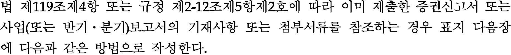
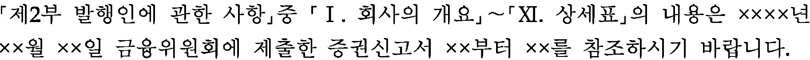
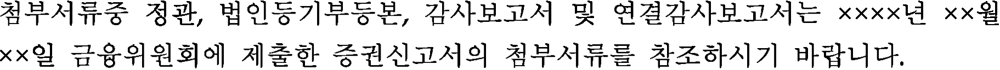
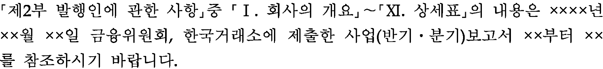

# 목차

**서식** : 증권신고서  
**별지 제1-1호 서식** : 주권회사의 주의의무 이행서류 ................................................... 37  
**별지 제1-2호 서식** : 회계감사인의 재무확인서 ........................................................... 41  
**별지 제2호 서식** : 증권신고서(IDS적용 외국기업) ..................................................  44  
**별지 제3호 서식** : 증권신고서(외국기업 외의 외국법인등) .....................................  77  
**별지 제4호 서식** : 증권신고서(파생결합증권 등) ......................................................... 91  
**별지 제5호 서식** : 증권(일반)신고서(집합투자증권-신탁형) ................................. 110  
**별지 제6호 서식** : 증권(일반)신고서(집합투자증권-회사형) .................................. 125  
**별지 제7호 서식** : 증권신고서(유동화증권) ................................................................. 141  
**별지 제8호 서식** : 삭제<2021.7.13.> ……………………………………………………... 154  
**별지 제9호 서식** : 증권신고서(합병등) ........................................................................ 158  
**별지 제10호 서식** : 증권신고서(집합투자증권 합병) ................................................ 178  
**별지 제11호 서식** : 일반공시서류 .................................................................................... 184  
**별지 제12호 서식** : 일반공시서류(파생결합증권 등) ................................................  200  
**별지 제12.1호 서식** : 일반신고서(파생결합증권-금전신탁 등) ............................ 215  
**별지 제13호 서식** : 일반신고추가서류 .......................................................................... 233  
**별지 제14호 서식** : 일반신고추가서류(파생결합증권 등) ........................................ 243  
**별지 제15호 서식** : 소액공모공시서류 .......................................................................... 252  
**별지 제16호 서식** : 소액공모공시서류(파생결합증권 등) ....................................... 272  
**별지 제17호 서식** : 소액공모공시서류(외국기업 외의 외국법인등) ................... 289  
**별지 제18호 서식** : 소액공모공시서류(합병등) .......................................................... 300  
**별지 제19호 서식** : 효과가증재시 실험을 통한 소액매출공시서류 ...................... 319  
**별지 제20호 서식** : 투자설명서(예비투자설명서) ...................................................... 329  
**별지 제21호 서식** : 투자설명서(집합투자증권) ........................................................... 333  
**별지 제22호 서식** : 간이투자설명서 ............................................................................... 335  
**별지 제23호 서식** : 간이투자설명서(집합투자증권) ................................................. 337  
**별지 제24호 서식** : 증권발행실적보고서 ....................................................................... 340  
**별지 제25호 서식** : 증권발행실적보고서(합병등) ..................................................... 346  
**별지 제26호 서식** : 증권발행실적보고서(집합투자증권) ......................................... 349

서식> 충권발행 실적보고서(겸합투자증권-합병) ...... 351  
<별지 제28호 서식> : 소액공모실적보고서 ............................................................. 353  
<별지 제29호 서식> : 소액공모실적보고서(합병등) .............................................. 357  
<별지 제30호 서식> : 철회신고서 ......................................................................... 360  
<별지 제31호 서식> : 시장조성신고서 ................................................................. 361  
<별지 제32호 서식> : 시장조성보고서 ................................................................. 363  
<별지 제33호 서식> : 안정조작신고서 ................................................................. 366  
<별지 제34호 서식> : 안정조작보고서 ................................................................. 368  
<별지 제35호 서식> : 사업(반기,분기)보고서 ........................................................ 371  
<별지 제35-1호 서식> : 소액공모법인 결산서류 ................................................... 386  
<별지 제35-2호 서식> : 사업(반기,분기)보고서 제출 기한 연장 신고서 ............. 387  
<별지 제35-3호 서식> : 회사의 사업(반기,분기)보고서 제출기한 연장에 대한 회계 감사인의 사유서 .......................................... 389  
<별지 제36호 서식> : 사업(반기,분기)보고서(외국기업 외의 외국법인등) ........ 390  
<별지 제37호 서식> : 사업(반기,분기)보고서(유동화전문회사) ..................... 395  
<별지 제38호 서식> : 중요사항보고서 ................................................................. 404  
<별지 제38-1~38-47호 서식> : 중요사항보고서 ................................................. 409  
<별지 제38-1호 서식> : 부도발생 ......................................................................... 413  
<별지 제38-2호 서식> : 은행거래 정지·금지 .................................................... 414  
<별지 제38-3호 서식> : 영업정지 ......................................................................... 415  
<별지 제38-4호 서식> : 회생절차 개시신청 ........................................................ 416  
<별지 제38-5호 서식> : 해산사유 발생 ................................................................. 417  
<별지 제38-6호 서식> : 유상증자 결정 ................................................................. 418  
<별지 제38-7호 서식> : 무상증자 결정 ................................................................. 432  
<별지 제38-8호 서식> : 유무상증자 결정 ............................................................. 434  
<별지 제38-9호 서식> : 감자 결정 ......................................................................... 447  
<별지 제38-10호 서식> : 채권은행 등의 관련절차 개시 ......................................... 449  
<별지 제38-11호 서식> : 삭제 <2013.8.29.> .......................................................... 450  
<별지 제38-12호 서식> : 소송 등의 제기 ............................................................. 451  
<별지 제38-13호 서식> : 해외 증권시장 주권등 상장 결정 ............................. 452  
<별지 제38-14호 서식> : 해외 증권시장 주권등 상장폐지 결정 ................... 454  
<별지 제38-15호 서식> : 해외 증권시장 주권등 상장 ..................................... 455  
<별지 제38-16호 서식> : 해외 증권시장 주권등 상장폐지 ............................. 456  
<별지 제38-17호 서식> : 해외 증권시장 주권등 매매거래정지 등 조치 ........ 457

호 서식> : 외국법인등의 외국투자 등 변경 .................................. 458
별지 제38-19호 서식> : 외국법인등의 주식 등에 대한 외국에서의 공개매수 .. 459
별지 제38-20호 서식> : 외국법인등의 주식 등에 대한 외국어서의 안정조작 등 .. 460
별지 제38-21호 서식> : 외국법인등의 해외법규 위반으로 인한 조치 .............. 461
별지 제38-22호 서식> : 외국법인등의 외국거래소로부터 매매거래정지·해제 .. 462
별지 제38-23호 서식> : 외국법인등의 외국거래소로부터 상장폐지 ............... 463
별지 제38-24호 서식> : 전환사채권 발행결정 ....................................... 464
별지 제38-25호 서식> : 신(교)주수권부사채권 발행결정 .......................... 472
별지 제38-26호 서식> : 교환사채권 발행결정 ..................................... 483
별지 제38-27호 서식> : 채권은행 등의 관리절차 중단 ............................. 486
별지 제38-28호 서식> : 전환형 조건부자본증권 발행결정 ........................ 487
별지 제38-29호 서식> : 상각형 조건부자본증권 발행결정 ......................... 491
별지 제38-30호 서식> : 전환형 조건부자본증권의 주식전환 사유 발생 ......... 495
별지 제38-31호 서식> : 상각형 조건부자본증권의 채무재조정 사유 발생 ......... 496
별지 제38-32호 서식> : 자기주식 취득 결정 ......................................... 497
별지 제38-33호 서식> : 자기주식 처분 결정 ......................................... 501
별지 제38-34호 서식> : 자기주식취득 신탁계약 체결 결정 ....................... 505
별지 제38-35호 서식> : 자기주식취득 신탁계약 해지 결정 ...................... 509
별지 제38-36호 서식> : 영업양수 결정 ................................................ 512
별지 제38-37호 서식> : 영업양도 결정 ................................................ 514
별지 제38-38호 서식> : 유형자산 양수 결정 ........................................ 516
별지 제38-39호 서식> : 유형자산 양도 결정 ........................................ 518
별지 제38-40호 서식> : 타법인 주식 및 출자증권 양수결정 .................... 520
별지 제38-41호 서식> : 타법인 주식 및 출자증권 양도결정 ..................... 524
별지 제38-42호 서식> : 주권 관련 사채권 양수 결정 .............................. 526
별지 제38-43호 서식> : 주권 관련 사채권 양도 결정 .............................. 533
별지 제38-44호 서식> : 회사합병 결정 ................................................. 535
별지 제38-45호 서식> : 회사분할 결정 ................................................. 540
별지 제38-46호 서식> : 회사분할합병 결정 ........................................... 543
별지 제38-47호 서식> : 주식교환·이전 결정 ........................................ 548
별지 제38-48~49호 서식> : 주요사항보고서 .......................................... 551
별지 제38-48호 서식> : 제3자의 전환사채매수선택권 행사 .......... 554
별지 제38-49호 서식> : 자기 전환사채 매도 결정 ............... 559

<별지 제38-50호 서식> : 자본으로 인정되는 채무증권 발행결정 ....................................568  
<별지 제38-51∼38-52호 서식> : 주요사항보고서 ........................................................572  
<별지 제38-51호 서식> : 제3자의 전환주식매수선택권 행사 .....................................575  
<별지 제38-52호 서식> : 자기 전환주식 매도 결정 ..................................................579  
<별지 제39호 서식> : 공개매수신고서 ....................................................................583  
<별지 제40호 서식> : 공개매수설명서 ....................................................................590  
<별지 제41호 서식> : 공개매수결과보고서 .............................................................592  
<별지 제42호 서식> : 공개매수철회신고서 .............................................................594  
<별지 제43호 서식> : 공개매수에 관한 의견표명서 ...............................................596  
<별지 제44호 서식> : 주식등의 대량보유상황보고서(일반) ..................................598  
<별지 제45호 서식> : 주식등의 대량보유상황보고서(약식) ..................................631  
<별지 제46호 서식> : 임원·주요주주 특정증권등 소유상황보고서 ....................665  
<별지 제46-1호 서식>: 임원·주요주주 특정증권등 거래계획보고서 ....................676  
<별지 제46-2호 서식>: 임원·주요주주 특정증권등 거래계획 철회보고서 ...........688  
<별지 제47호 서식> : 의결권대리행사권유 참고서류 ...........................................692  
<별지 제48호 서식> : 의결권대리행사권유에 관한 의견표명서 ...........................739  
<별지 제49호 서식> : 대량주식취득승인신청서 ....................................................741  
<별지 제50호 서식> : 대량주식취득보고서 ............................................................745  
<별지 제51호 서식> : 자기주식취득 결과보고서 ...................................................747  
<별지 제52호 서식> : 자기주식처분 결과보고서 ...................................................751  
<별지 제53호 서식> : 신탁계약에의한 취득상황보고서 .........................................755  
<별지 제54호 서식> : 신탁계약해지 결과보고서 ...................................................758  
<별지 제55호 서식> : 합병등 종료보고서 .................................................................761  
<별지 제56호 서식> : 주식매수선택권 부여에 관한 신고 ......................................764  
<별지 제57호 서식> : 사외이사의 선임·해임 또는 중도퇴임에 관한 신고·767  
<별지 제58호 서식> : 주주총회소집공고 .................................................................770  

<별지 제1호 서식>: 증권신고서

(지분증권, 채무증권, 증권예탁증권, 투자계약증권)
금융위원회 귀중

년 월 일

대표이사:
본점소재지:
(전화)
(홈페이지) http://

직책
(성명)
(전화)

모집 또는 매출 증권의 종류 및 수:

모집 또는 매출총액:

증권신고서 및 투자설명서 열람장소

가. 증권신고서
전산문서: 금융위(금감원) 전자공시시스템 → http://dart.fss.or.kr

나. 투자설명서
서면문서:

i. 발행인의 유형에 따라 회사명은 영업자명 등 신고인의 이름을, 대표이사는 업무집행사원, 발기인대표 등 대표자의 이름을 기재한다.

행 및 공시등에 관한 규정 제6-7조에 따라 증권신고서를 서면으로 제출하
는 경우 대표이사의 도장(또는 회사의 직인)을 찍어 제출한다.

iii. ESG채권으로 발행되는 채무증권의 경우 “모집 또는 매출 증권의 종류 및 수”에 ESG
채권종류(녹색채권, 사회적채권, 지속가능채권 등)를 기재한다.

(작성 예시)
㈜OOO 제OOO회 무기명식 이권부 무보증사채(녹색채권)
㈜OOO 제OOO회 상각형 조건부자본증권(후순위채)(사회적채권)

iv. 투자설명서 서면문서의 열람장소는 투자설명서를 열람할 수 있는 곳의 명칭과 전화번
호를 기재한다(모든 지점의 주소, 전화번호 등을 기재할 필요는 없다).

v. 외국기업의 경우 대리인에 관한 사항(대리인명, 대표자, 주소, 전화번호 등)을 추가하여
기재한다.

vi. 정정증권신고서의 경우 ‘증권신고서 제출 및 정정 연혁’ 항목을 추가 기재한다. 동 항
목에는 제출일자(또는 정정신고서 제출을 요구받은 일자)와 함께 문서명(실제 Dart시스
템에 등록되어 공시되는 문서제목)을 기재하고, 비고란에는 정정요구 또는 자진정정 여
부, 정정요구 차수 등을 표시한다. 또한, [기재정정]증권신고서 뿐만 아니라 [첨부정
정]증권신고서의 제출내역도 포함하여 기재한다.

(작성예시)

| 증 권 신 고 서 (지분증권) |   |
| --- | --- |
| 제출일자 | 문서명 | 비고 |
| 2011-05-27 | 증권신고서(주식) | 최초 제출일 |
| 2011-05-31 | [첨부정정]증권신고서(주식) | 자진정정 |
| 2011-06-03 | 금융위 정정신고서 제출 요구 | 1차 |
| 2011-06-14 | [기재정정]정정신고서(주식) | 정정요구(1차) |
| 2011-6-20 | 금융위 정정신고서 제출 요구 | 2차 |
| 2011-6-30 | [기재정정]정정신고서(주식) | 정정요구(녹색채권) |

금융위원회 귀중  
대표이사:  
본점소재지:

2011년 6월 30일

- 2 -

# 작성지침

## I. 적용대상

**6_0.png**  
본 지침과 금융투자업에 관한 법률 제119조 제1항에 따른 증권의 신고에 사용된다. 다만 파생결합증권, 집합투자증권, 유동화증권의 신고와 합병 등의 증권신고 및 외국기업 외의 외국법인 등의 증권신고는 제외한다.

## II. 공시서류작성기준일 및 공시대상기간

**6_1.png**  
공시서류작성기준일은 증권신고서 제출일 전일로 한다. 다만, 『발행인에 관한 사항』 중 『재무에 관한 사항』、『회계감사인의 감사의견 등』、『부속명세서』 등 회사의 회계처리 또는 감사와 관련된 사항과 사업의 내용 중 사업연도별로 비교표시하는 사항 등(이하 『재무에 관한 사항 등』)은 제출일이 속하는 사업연도의 최근 사업연도(또는 반기, 분기)말을 공시서류작성기준일로 한다.

**6_2.png**  
적용되는 공시대상기간은 최근 3사업연도등로 한다. 최근 3사업연도등 공시서류작성기준일이 속하는 사업연도의 직전사업연도를 포함한 최근 3사업연도의 개시일부터 공시서류작성기준일까지를 말하며, 공시서류작성기준일이 속하는 사업연도의 반기보고서 또는 반기보고서 제출되었다면 분기보고서 또는 반기보고서에 기재된 내용을 포함하는 경우 공시서류작성기준일이 속하는 사업연도의 직전사업연도를 포함한 최근 2사업연도의 개시일부터 공시서류작성기준일까지로 한다.

**6_3.png**  
정한 사항에도 불구하고 기업공시서식 작성기준 및 서식에서 별도로 공시서류작성기준일 또는 공시대상기간을 정하는 경우에는 그에 따르며, 공시대상기간의 적용은 위 2의 방식을 준용한다. 투자자의 오해를 방지하기 위한 경우 등으로서 회사가 필요하다고 인정하는 경우에는 공시대상기간을 연장할 수 있다.

**6_4.png**  
작성기준에서 공시대상기간을 『공시서류작성기준일이 속하는 사업연도 개시일부터 공시서류작성기준일』로 정하는 경우, 전전 사업연도의 사업보고서가 제출되지 않은 때에는 『공시서류작성기준일이 속하는 사업연도의 직전 사업연도 개시일부터 공시서류작성기준일까지』의 내용을 기재한다.

i. 증권신고서 제출시기별 재무에 관한 사항 등의 구체적인 작성기준은 다음과 같다.
   가. 직전 사업연도에 대한 사업보고서 제출기일(사업연도 개시후 90일) 이전에 증권신고서를 제출하는 경우 재무에 관한 사항 등은 직전 사업연도 결산완료일까지의 사항을 기재한다. 다만, 증권신고서 제출일 현재 감사인이 회사의 감사보고서를 제출한 경우 직전 사업연도 결산완료까지의 사항을 기재한다.
   나. 직전 사업연도에 대한 사업보고서 제출기일 경과후(사업연도 개시 91일 이후)부터 당해 사업연도에 대한 1/4분기 분기보고서 제출기일(1/4분기결산일 이후 45일) 이전에 증권신고서를 제출하는 경우 재무에 관한 사항 등은 직전 사업연도 결산완료까지의 사항을 기재한다. 다만, 증권신고서 제출일 현재 1/4분기보고서를 제출한 경우 당해 사업연도 1/4분기결산일까지의 사항을 기재하며, 사업보고서 제출대상이 아닌 회사가 최초로 증권신고서를 제출하는 때에는 감사인의 감사 또는 검토를 받지 않은 경우에도 재무에 관한 사항 등은 '요약재무정보'에 당해사업연도 1/4분기결산일까지 사항을 기재한다.
   다. 당해 사업연도에 대한 1/4분기 분기보고서 제출기일 경과후(1/4분기결산일의 46일 이후)부터 당해 사업연도에 대한 반기보고서 제출기일(반기결산일 이후 45일) 이전에 증권신고서를 제출하는 경우 재무에 관한 사항 등은 당해사업연도 1/4분기결산일까지의 사항을 기재한다. 다만, 증권신고서 제출일 현재 반기보고서를 제출한 경우 당해사업연도 반기결산일까지의 사항을 기재하며, 사업보고서 제출대상이 아닌 회사가 최초로 증권신고서를 제출하는 때에는 감사인의 감사 또는 검토를 받지 않은 경우에도 재무에 관한 사항 중 '요약재무정보'에 당해사업연도 반기결산일까지 사항을 기재한다.
   라. 당해 사업연도에 대한 반기보고서 제출기일 경과후(반기결산일의 46일 이후)부터 당해 사업연도 3/4분기 분기보고서 제출기일(분기결산일 이후 45일) 이전에 증권신고서를 제출하는 경우 재무에 관한 사항 등은 당해 사업연도 반기결산일까지의 사항을 기재한다. 다만, 증권신고서 제출일 현재 3/4분기 분기보고서를 제출한 경우 당해 사업연도 3/4분기결산일까지의 사항을 기재하며, 사업보고서 제출대상이 아닌 회사가 최초로 증권신고서를 제출하는 때에는 감사인의 감사 또는 검토를 받지 않은 경우에도 재무에 관한 사항 중 '요약재무정보'에 당해사업연도 3/4분기결산일까지 사항을 기재한다.
   마. 당해 사업연도에 대한 3/4분기 분기보고서 제출기일 경과후(3/4분기결산일의 46일 이후)부터 당해 사업연도의 결산일 사이에 증권신고서를 제출하는 경우 재무에 관한 사항 등은 당해 사업연도 3/4분기결산일까지 사항을 기재한다.

ii. 작성지침의 사항 기재시 결산자료에 대하여 감사인의 감사 또는 검토(시행령 제137조의 규정에 의한 공인회계사의 확인 및 의견표시를 포함한다)를 받지 아니한 경우에는 재무제표 중 해당 항목에 그 사실과 이유를 명시하여야 한다.

iii. 공시대상기간이 `공시서류작성기준일에 속하는 사업연도의 개시일부터 공시서류작성기준일`인 경우 시기별 대상기간은 다음과 같다.
    
   가. 직전 사업연도에 대한 사업보고서 제출기일(사업연도 개시후 90일) 이전에 증권신고서를 제출하는 경우 직전 사업연도 개시일부터 공시서류작성기준일까지의 내용을 기재한다. 다만, 직전 사업연도에 대한 사업보고서를 제출한 경우에는 해당 사업연도 개시일부터 공시서류작성기준일까지의 내용을 기재한다.

   나. 직전 사업연도에 대한 사업보고서 제출기일 경과후(사업연도 개시 91일 이후) 증권신고서를 제출하는 경우 해당 사업연도 개시일부터 공시서류작성기준일까지의 내용을 기재한다.

### III. 참조방식 기재

#### 가. 참조사항

1. 이미 제출한 증권신고서 기재사항 및 첨부서류를 참조하는 경우
    
   

   
   
   
     
2. 이미 제출한 사업(또는 반기·분기)보고서 기재사항 및 첨부서류를 참조하는 경우
   
   
     
첨부서류중 정관, 법인등기부등본, 감사보고서 및 연결감사보고서는 xxxx년 xx월

회, 한국거래소에 제출한 사업(또는 반기·분기)보고서의 첨부서류를 참조하시기 바랍니다.

등은 증권을 취득하고자 하는 투자의 청구가 있는 때에는 참조된 내용을 제공하여야 하며, 이에 따른 별도의 비용은 청구하지 아니합니다.

- 증권신고서의 공시장소

: [금융위(금감원) 전자공시시스템 → http://dart.fss.or.kr], 전화번호: )

- 사업(분기·반기)보고서의 공시장소

: [금융위(금감원) 전자공시시스템 → http://dart.fss.or.kr], 전화번호: ) 한국거래소(주소: , 전화번호: )
